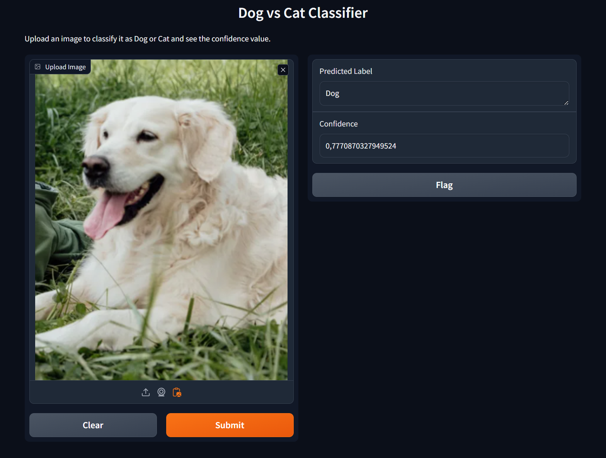

# Case Study: Cat vs. Dog Image Classification

### Project Description:
In this project, a deep learning model has been developed to classify whether an image is of a cat or a dog.

The Keras library's functional API has been used with a class-based structure to develop the CNN model from scratch.

### Dataset:
The dataset for the "Cat" and "Dog" classes has been downloaded from [kaggle](https://www.kaggle.com/c/dogs-vs-cats/data)
